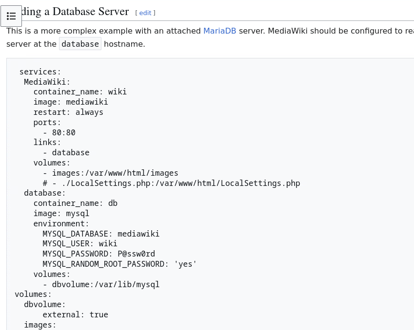
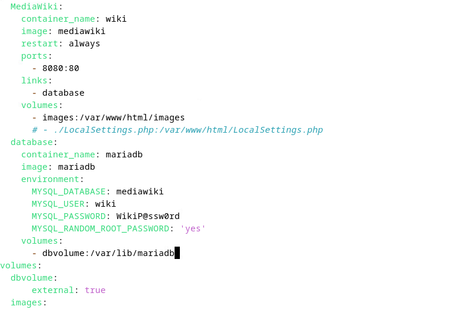
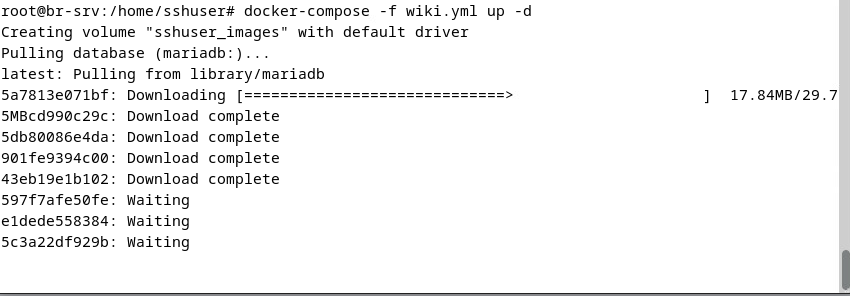
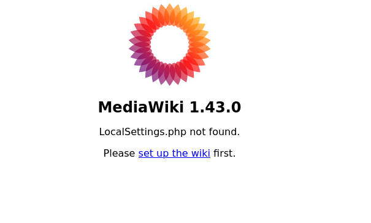
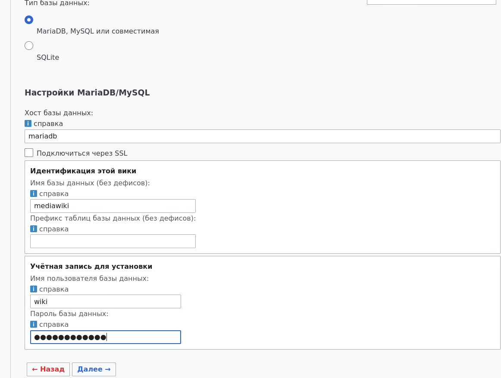
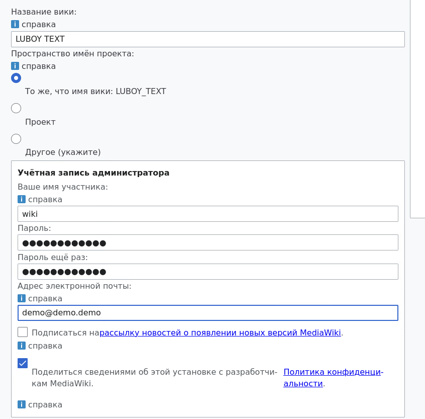
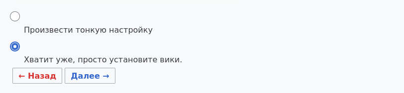
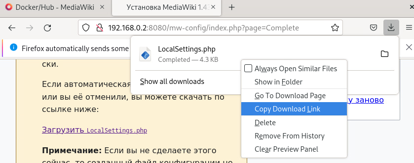
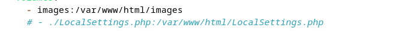

BR-SRV

**wget -qO-** [**https://get.docker.com**](https://get.docker.com) **| bash**

и установить docker-compos: **apt install docker-compose**

Для упрощённого создания файла wiki.yml нужно с HQ-CLI по ssh подключится к BR-SRV: **ssh -p 2026 sshuser@192.168.0.2**

После подключения по ssh на hq-cli открываем браузер и ищем mediawiki docker-compose (В заголовке около круга как скин градиент с формой шестерёнки написано MediaWiki, ссылка https://www.mediawiki.org, синяя подпись Docker/Hub)

На сайте ищем пункт "**Adding a database server**" и копируем весь конфиг

{width=849px height=678px}

теперь **переходим в директорию /home/sshuser и создаём в ней файл wiki.yml**. Заходим в этой файл. ВСЕ СТРОКИ, ОТМЕЧЕННЫЕ СТРЕЛКАМИ НЕОБХОДИМО ЗАПОЛНИТЬ КАК ПОКАЗАНО НА РИСУНКЕ 44!!!!!!!!!!!!!!!

{width=786px height=533px}

Рисунок 44 -- изменённый конфиг

Теперь создаём volume для докера: **docker volume create dbvolume**

После этого выполняем команду **docker-compose -f wiki.yml up -d** и запускаем стек контейнеров(Рисунок 45)

{width=850px height=296px}

Рисунок 45 -- Запуск стека

Ждём пока запуститься стек. После запуска **открываем браузер и переходи по ip: 192.168.0.2:8080(Адрес br-srv с указанием порта для mediawiki)**

{width=605px height=363px}

Рисунок 46 -- приветственное окно

Нажимаем СИНЮЮ ССЫЛКУ и выбираем язык. Соглашаемся с Авторскими правами и условиями.

На рисунке 47 выбираем базу данных. ТАКЖЕ СЛЕДУЕМ СТРЕЛОЧКАМ. ПАРОЛЬ: WikiP@ssw0rd

{width=1162px height=879px}

Рисунок 47 -- Выбор базы данных

На рисунке 48 идёт задача названия страницы, создание пользователя для авторизации. ТАКЖЕ СЛЕДУЕМ СТРЕЛОЧКАМ. НА РИСУНКЕ 49 ИДЁТ ПРОДОЛЖЕНИЕ РИСУНКА 48. Там нужно просто поставить галочку.

{width=846px height=833px}

Рисунок 48 -- создание базовой страницы и пользователям

{width=812px height=188px}

Рисунок 49 -- ТА САМАЯ ГАЛОЧКА

На рисунке 50 показан файл.

{width=839px height=332px}

Рисунок 50 -- Файл для установки

Перекидываем файл на br-srv:

**scp -P 2024 /home/locadm/Downoloads/LocalSettings.php sshuser@192.168.0.2:/home/sshuser**

Переходим в файл wiki.yml и раскмоментируем единственную закоментированную строчку(рисунок 51). УБЕРИТЕ ЛИШНИЙ ПРОБЕЛ: СТРОКИ images и раскоменченная строка должны быть на одно уровне

{width=682px height=53px}

Рисунок 51 -- Строка которую нужно раскоментировать

перезапускаем сервисы:

docker-compose -f wiki.yml stop

docker-compose -f wiki.yml up -d

Заходим в браузер на HQ-CLI и вводим 192.168.0.2:8080. Вы должны увидеть лицевую страницу mediawiki